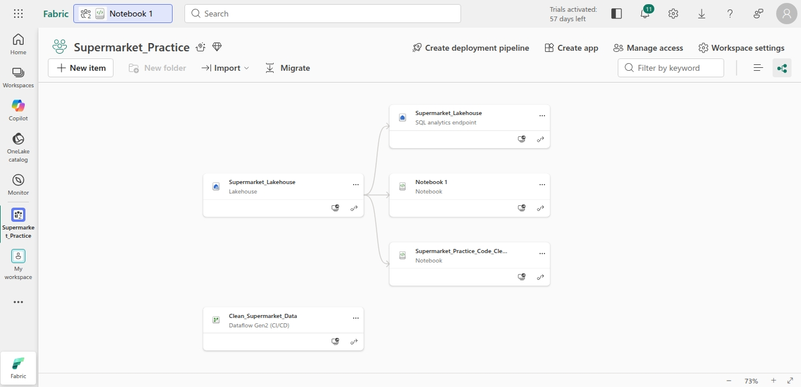
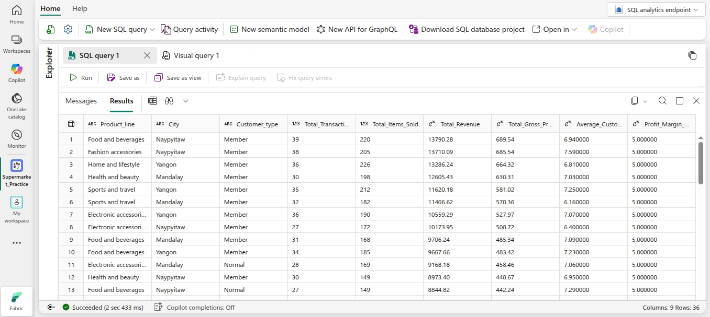
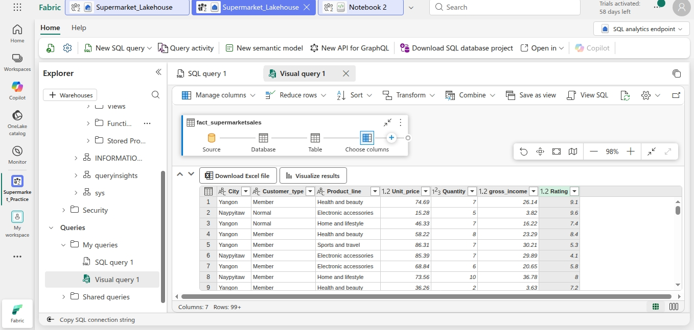
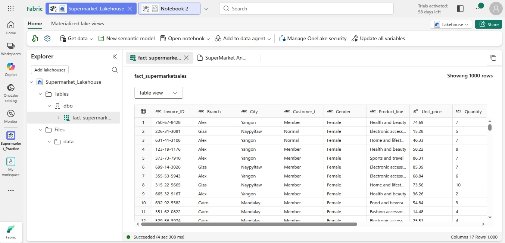

# 🛒 Supermarket Sales Data Engineering (Microsoft Fabric)

### 🎯 Project Objective
This project demonstrates the end-to-end transformation of unoptimized retail data into an enterprise-grade **Delta Table**. Using the **Medallion Architecture**, I converted raw CSV files into structured, typed, and query-optimized assets within the Microsoft Fabric Lakehouse.

---

### 📂 Repository Contents
* **[Raw_Data/](./Raw_Data/):** Contains the original, uncleaned `SuperMarket Analysis.csv` dataset used as the "Bronze" layer input.
* **[Python_Code/](./Python_Code/):** Contains the PySpark `.py` logic for data cleaning and schema enforcement.
* **[Screenshots/](./Screenshots/):** Visual documentation of the pipeline and SQL results.
* **[Reports/](./Reports/):** Contains `Query.xlsx`, the final exported analytical report featuring the processed 'Gold' layer data for business stakeholders.
* **[Data Source/](https://www.kaggle.com/datasets/faresashraf1001/supermarket-sales):** Original Kaggle Supermarket Sales dataset.

---

### 🏗️ Architecture & Workflow

1. **Bronze (Raw):** Ingested the Kaggle CSV into OneLake via **Dataflow Gen2**.
2. **Silver (Engineered):** Leveraged a **Fabric Spark Notebook** to:
   * Programmatically sanitize column headers (replaced spaces with underscores).
   * Cast critical fields (`Unit_price`, `Quantity`, `Sales`) to appropriate numeric types.
   * **Key Fix:** Resolved `[DELTA_FAILED_TO_MERGE_FIELDS]` schema conflicts using `.option("overwriteSchema", "true")`.
3. **Gold (Curated):** Finalized Delta Table exposed via **SQL Analytics Endpoint** for high-performance BI querying.

---

### 🛠️ Key Technical Hurdle: Schema Evolution
While transitioning from string-based CSV data to numeric Delta columns, I encountered a schema mismatch error. By implementing explicit casting and the `overwriteSchema` option in Spark, I ensured data integrity and enabled mathematical operations in SQL without further casting.


```python
# The "Fix" that enabled Query Folding and Performance
df.write.format("delta") \
  .mode("overwrite") \
  .option("overwriteSchema", "true") \
  .saveAsTable("fact_SupermarketSales")
```


### 📊 Visual Documentation & Results

#### 1. End-to-End Data Lineage
*Shows the automated flow from the raw CSV source to the Spark Notebook and finally into the Lakehouse.*


#### 2. SQL Analytics Results
*Direct T-SQL query execution on the Delta Table, proving successful data type casting and aggregation.*


#### 3. Visual Query Interface
*Demonstrating the 'Low-Code' transformation path and results within the Fabric UI.*


#### 4. The Final Delta Table (fact_supermarketsales)
*A preview of the cleaned, partitioned, and typed 'Gold' layer table.*



---

## 🙏 Acknowledgements
* **Data Source:** A special thanks to [Fares Ashraf](https://www.kaggle.com/faresashraf1001) (or the specific creator) on Kaggle for providing the [Supermarket Sales Dataset](https://www.kaggle.com/datasets/faresashraf1001/supermarket-sales). This dataset was instrumental in demonstrating end-to-end data engineering workflows in Microsoft Fabric in this project.
* **Inspiration:** Developed as part of a Microsoft Fabric Analytics Engineering study path to master Medallion Architecture and Delta Lake schema evolution.